---

# 📢 Yappin' - Microblogging Application

## Overview
**Yappin'** is a microblogging platform designed to provide a dynamic and interactive user experience. The project has evolved through multiple stages, incorporating new features based on user feedback and technical improvements. This document summarizes the key features and functionalities implemented in the project.

---

## 🎯 Features Summary

### 1️⃣ User Authentication & Session Management
- Users can **register** and **log in** using either **Google OAuth** or a **standard username-password** system.
- Secure authentication is managed via `express-session`.
- Users can log out anytime, and their session data is cleared.

🔹 **Google Login Page:**
<p align="left">
  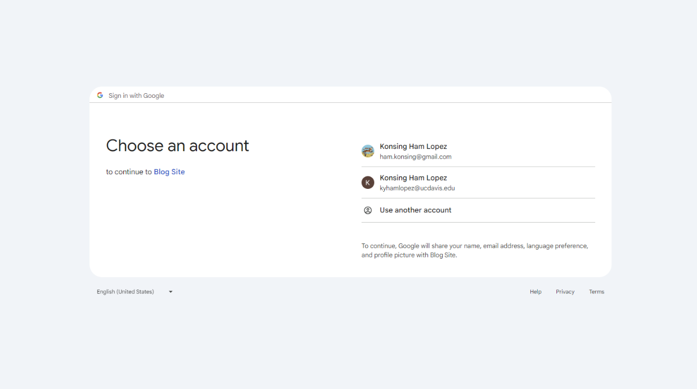
</p>

🔹 **Standard Login Page:**
<p align="left">
  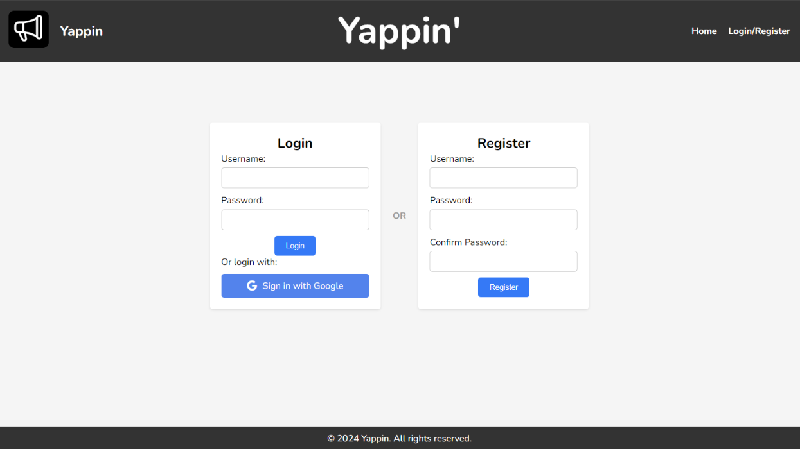
</p>

🔹 **Standard Login Page (After Successfully Registered):**
<p align="left">
  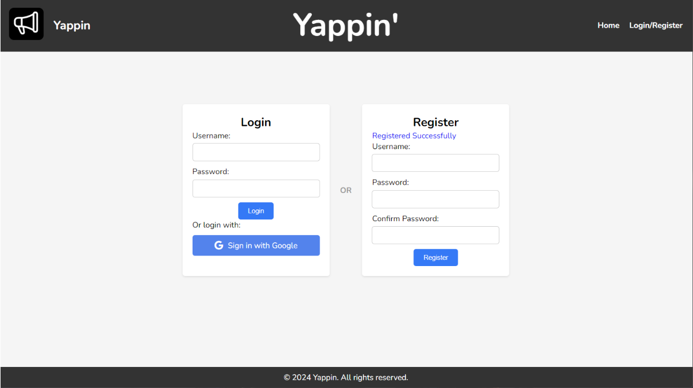
</p>

🔹 **Permission Request (Google OAuth):**
<p align="left">
  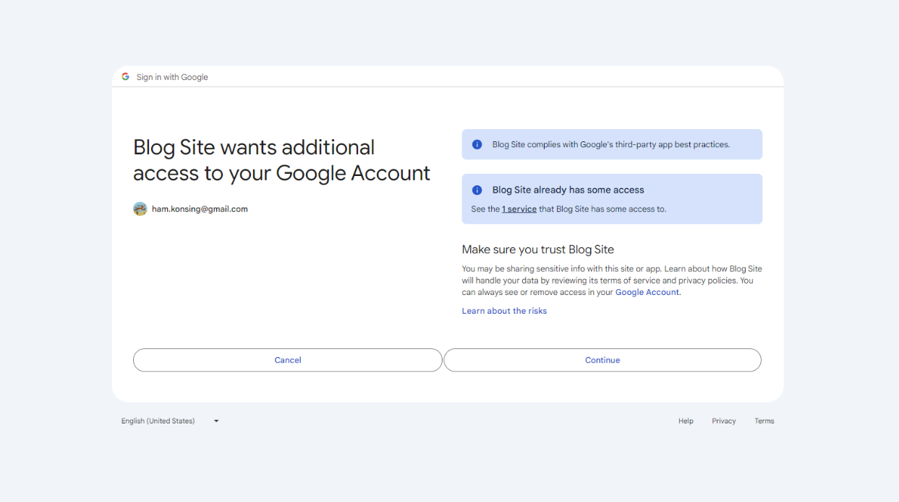
</p>

🔹 **Username Selection After Google Login:**
<p align="left">
  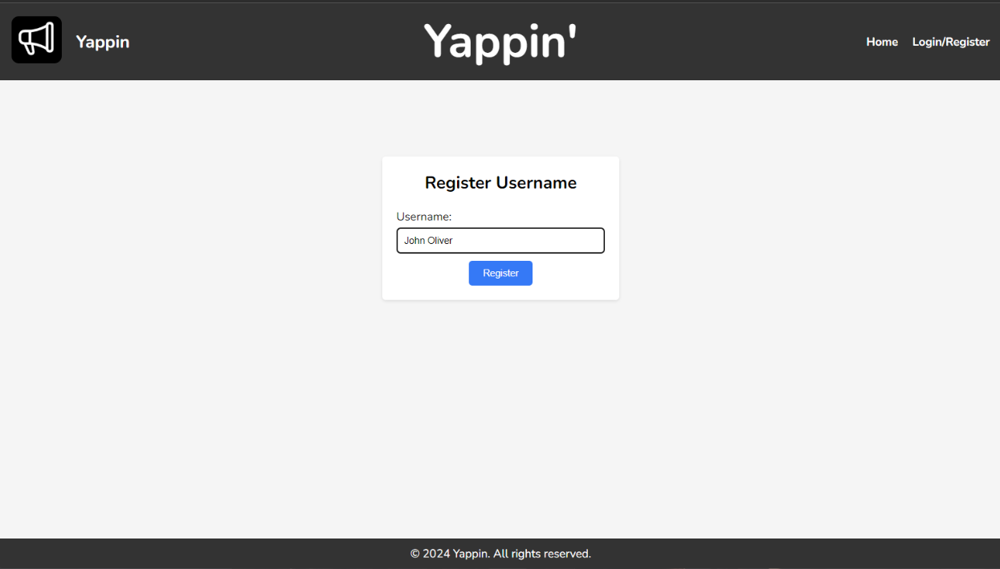
</p>

---

### 2️⃣ Post Management ✏️
- Users can **create, edit, and delete posts**.
- Posts support **Markdown text**, which is converted to HTML using the `marked` library.
- Posts display **usernames, avatars, timestamps, and formatted content**.

📝 **Creating a Post:**
<p align="left">
  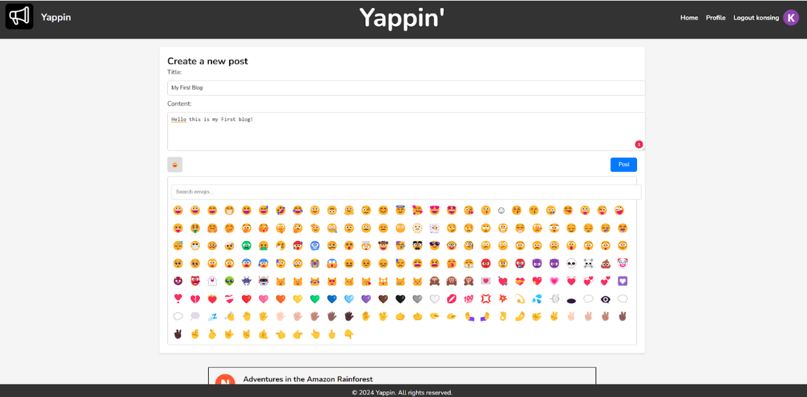
</p>

🛠️ **Editing a Post:**
<p align="left">
  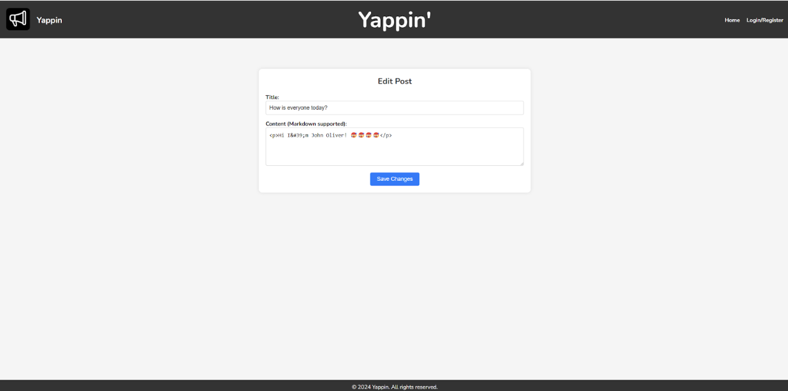
</p>

---

### 3️⃣ Post Interaction ❤️
- Users can **like posts**, with likes updating dynamically.
- Sorting options include **sorting posts by likes or recency**.

📌 **Homepage (Not Logged In View):**
<p align="left">
  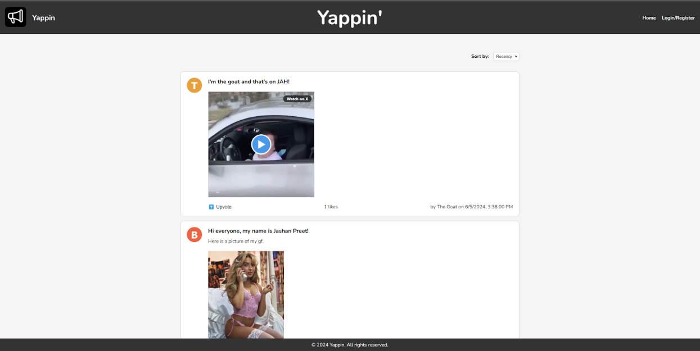
</p>

📌 **Homepage (Logged In View):**
<p align="left">
  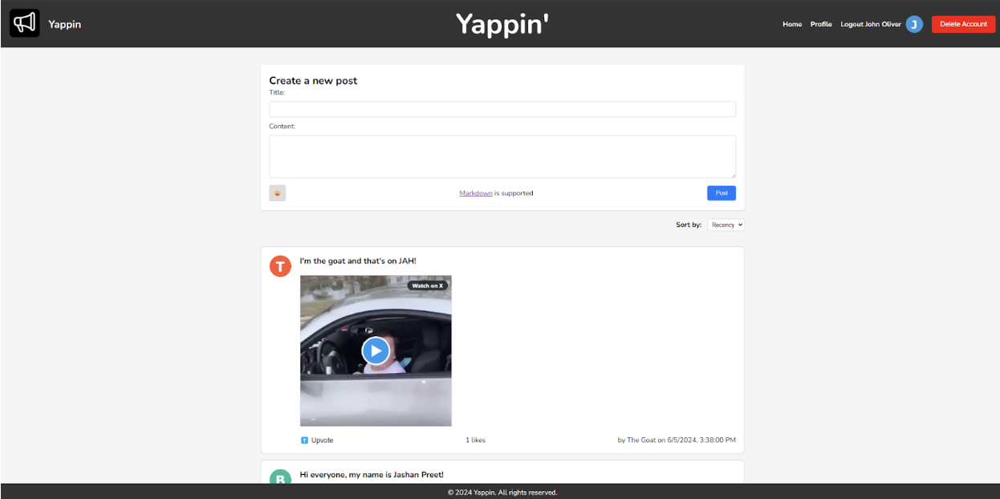
</p>

---

### 4️⃣ User Profile Management 👤
- Each user has a **profile page** displaying their posts and account details.
- Users can delete their accounts, removing all their posts.

👥 **User Profile Page:**
<p align="left">
  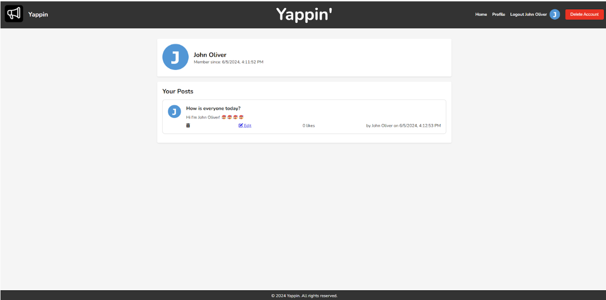
</p>

❌ **Account Deletion Confirmation:**
<p align="left">
  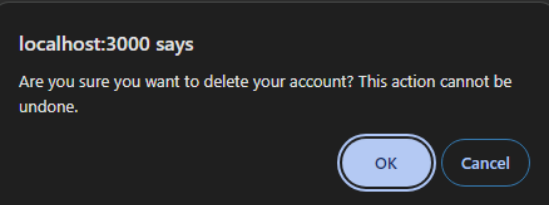
</p>

---

## ⚙️ Technical Implementation

### 🛢️ 1. Database Persistence with SQLite
- The backend uses **SQLite** for persistent storage.
- The database contains two primary tables:
  - **Users Table:** Stores username, hashed Google ID, avatar URL, and account creation date.
  - **Posts Table:** Stores post content, associated username, timestamp, and like count.

### 🔐 2. OAuth Integration
- **Google OAuth authentication** implemented using `Passport.js`.
- Uses `.env` file to securely store API keys.

### 🎨 3. Enhanced UI and JavaScript Features
- **Dynamic sorting of posts** based on likes or recency.
- **AJAX-powered like system** for real-time updates.
- **Emoji picker** for inserting emojis into posts.

---

## 🚀 Upcoming Features
The project will continue to evolve with the following planned enhancements:
- **🖼️ Avatar Upload System**: Allow users to upload custom profile pictures.
- **📌 Advanced Filtering & Sorting**: More post filtering options.
- **🔔 Notification System**: Alerts for likes, comments, and followers.

---

## 🛠️ Installation & Setup

1️⃣ **Clone the Repository**
   ```sh
   git clone https://github.com/your-repo/yappin.git
   cd yappin
   ```

2️⃣ **Install Dependencies**
   ```sh
   npm install
   ```

3️⃣ **Setup Environment Variables**
   - Create a `.env` file and add:
     ```
     CLIENT_ID=your_google_oauth_client_id
     CLIENT_SECRET=your_google_oauth_secret
     ```

4️⃣ **Initialize Database**
   ```sh
   node populatedb.js
   ```

5️⃣ **Run the Application**
   ```sh
   npm start
   ```

The application will be available at `http://localhost:3000/`.

---

For any questions or contributions, feel free to reach out! 🚀✨

---