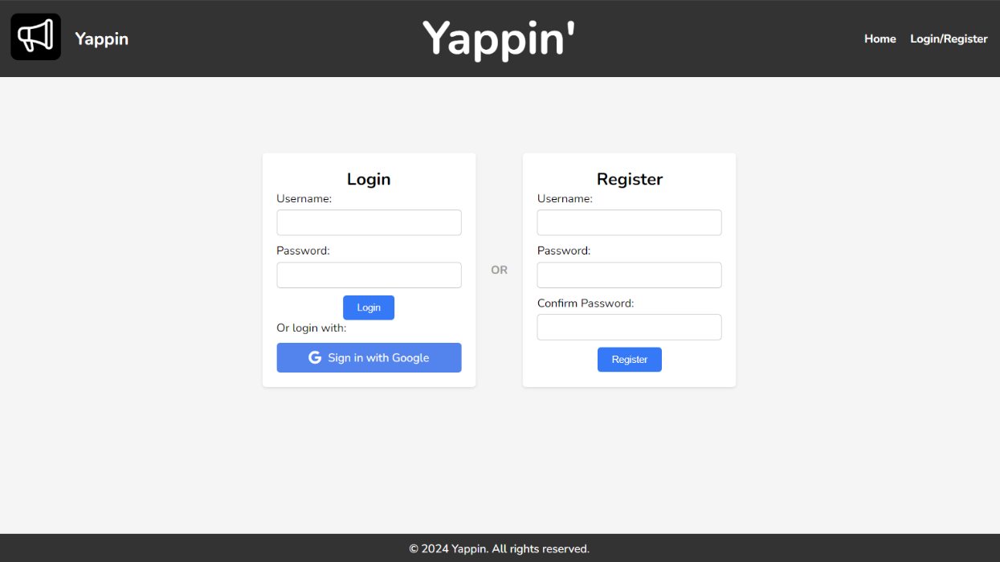
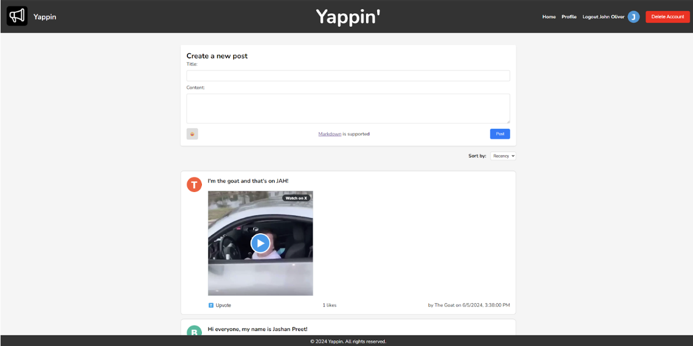
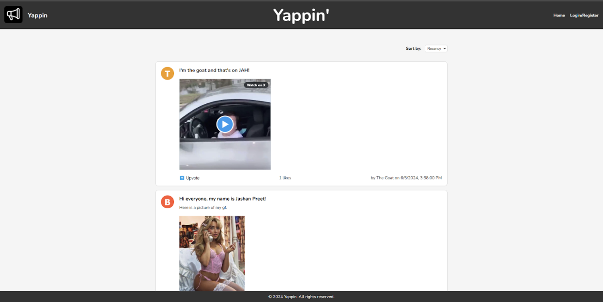
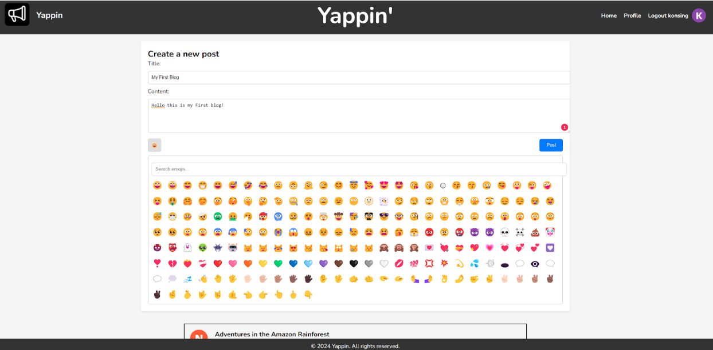
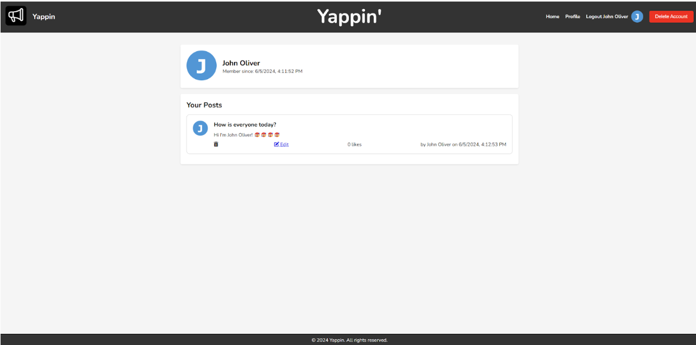

---

# Yappin' - Microblogging Application

## Overview
**Yappin'** is a microblogging platform with a warm, playful design. Users can create markdown-powered posts, like and interact with others' content, and authenticate via Google OAuth or local username/password registration.

---

## Features

### User Authentication
- **Google OAuth** login via Passport.js (requires `.env` credentials)
- **Local registration** with username/password (bcrypt-hashed)
- Session-based auth with `express-session`
- Users can delete their accounts from the profile page

### Post Management
- Create, edit, and delete posts
- **Markdown** support via `marked` (rendered and sanitized with `sanitize-html`)
- Embedded content support (Twitter/X, Instagram, YouTube iframes)
- Dynamic avatars generated server-side with `canvas`

### Post Interaction
- Upvote/un-upvote posts (AJAX, no page reload)
- Sort by **newest** or **most liked**
- Emoji picker for composing posts

### Sidebar (Logged-In Users)
- Profile card with post count and total likes received
- Community stats: total posts, total users, most active user

### Profile Page
- User stats (posts, likes received)
- List of your posts
- Account deletion with confirmation prompt

---

## Tech Stack

| Layer | Technology |
|-------|-----------|
| Server | Node.js, Express |
| Templates | Handlebars (express-handlebars) |
| Database | SQLite (via `sqlite` / `sqlite3`) |
| Auth | Passport.js (Google OAuth 2.0), bcrypt |
| Security | sanitize-html (XSS prevention) |
| Rendering | marked (Markdown), canvas (avatars) |
| Styling | Custom CSS (Nunito font, amber/orange palette) |
| Containerization | Docker (node:20-alpine) |

---

## Database Schema

**users** — `id`, `username`, `hashedGoogleId`, `avatar_url`, `memberSince`, `passwordHash`

**posts** — `id`, `title`, `content`, `username`, `timestamp`, `likes`, `isMarkdown`

**likes** — `id`, `postId`, `username`

---

## Setup

**1. Clone and install**
```sh
git clone https://github.com/Konsing/Yappin-Blog-Site_Full_Stack.git
cd Yappin-Blog-Site_Full_Stack
npm install
```

**2. Configure environment**

Copy the example and fill in your values:
```sh
cp .env.example .env
```

| Variable | Required | Where to get it |
|----------|----------|----------------|
| `CLIENT_ID` | For Google login | [Google Cloud Console](https://console.cloud.google.com) > APIs & Services > Credentials > OAuth client ID |
| `CLIENT_SECRET` | For Google login | Same as above |
| `SESSION_SECRET` | Yes | Any random string (`node -e "console.log(require('crypto').randomBytes(32).toString('hex'))"`) |
| `EMOJI_API_KEY` | For emoji picker | [emoji-api.com](https://emoji-api.com) |
| `PORT` | No (default 3000) | — |

Google OAuth redirect URI must be set to `http://localhost:3000/auth/google/callback`.

**3. Seed the database (optional)**
```sh
npm run populate-db
```

**4. Run**
```sh
npm start
```

Open `http://localhost:3000/`.

---

## Docker

```sh
docker build -t yappin .
docker run -p 3000:3000 --env-file .env yappin
```

---

## Screenshots

> Note: Screenshots below are from an earlier version of the UI. The current design uses a warm amber/orange theme with a sidebar layout.

**Login / Register:**

<p align="left">
  
</p>

**Homepage (Logged In):**

<p align="left">
  
</p>

**Homepage (Not Logged In):**

<p align="left">
  
</p>

**Creating a Post:**

<p align="left">
  
</p>

**Profile Page:**

<p align="left">
  
</p>

---

## Scripts

| Command | Description |
|---------|-------------|
| `npm start` | Start the server |
| `npm run populate-db` | Seed the database with sample data |
| `npm run show-db` | Print database contents to console |

---
